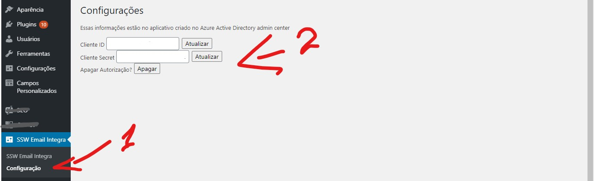
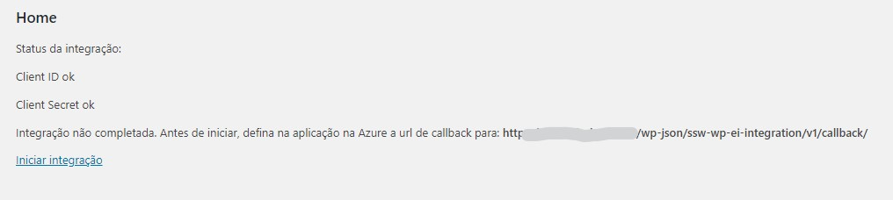
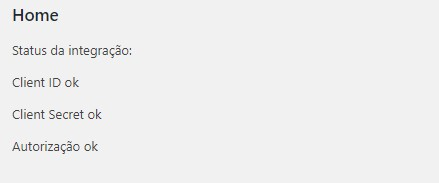

# SSW WP Email Integration - Outlook

## Passos para conexão com email:

- Crie o aplicativo na Azure admin center: 
[Doc Microsoft app registration](https://docs.microsoft.com/pt-br/azure/active-directory/develop/active-directory-v2-protocols#app-registration).

- adicione as informações na tela de configuração:

- Defina no aplicativo criado na Azure a url de callback:

- Clique em iniciar integração.

- Integração OK.

- A partir daí podemos fazer as requisições pelos métodos enquanto fazemos as requisições de token de acesso automaticamente e estamos prontos para usar a classe <code>EI_ssw_wp_outlook</code>
